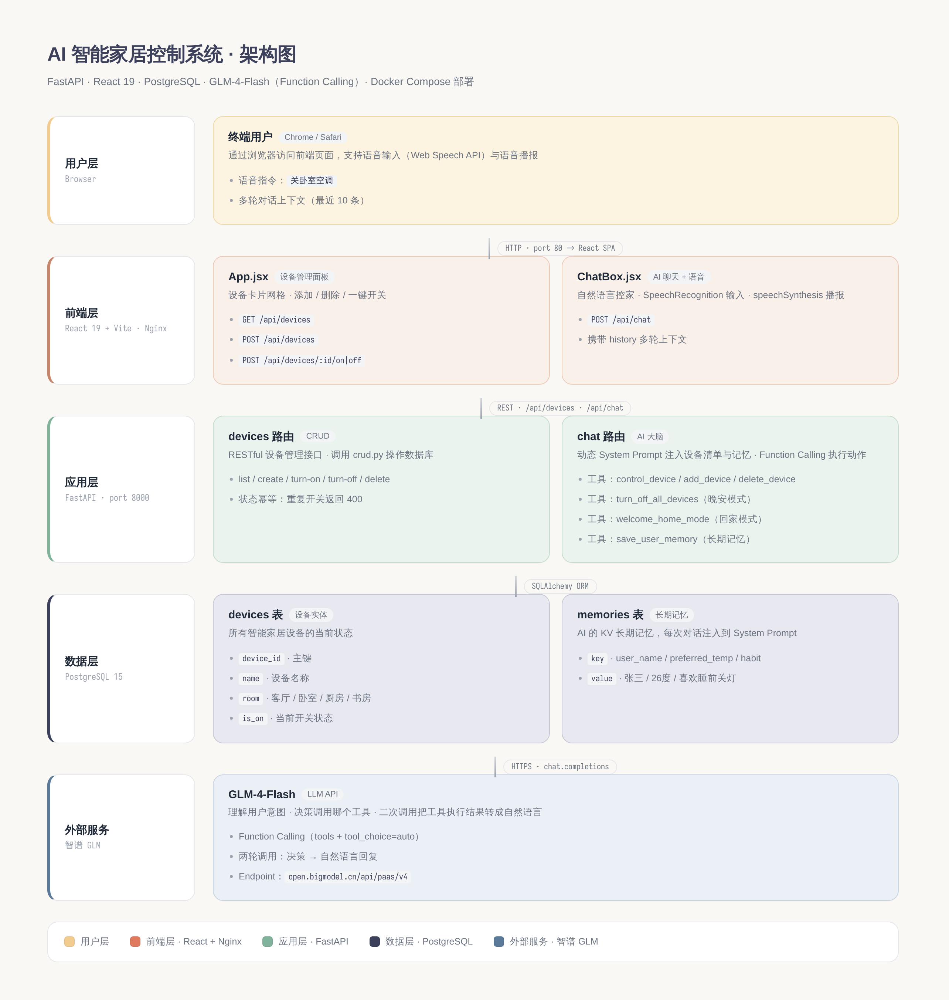
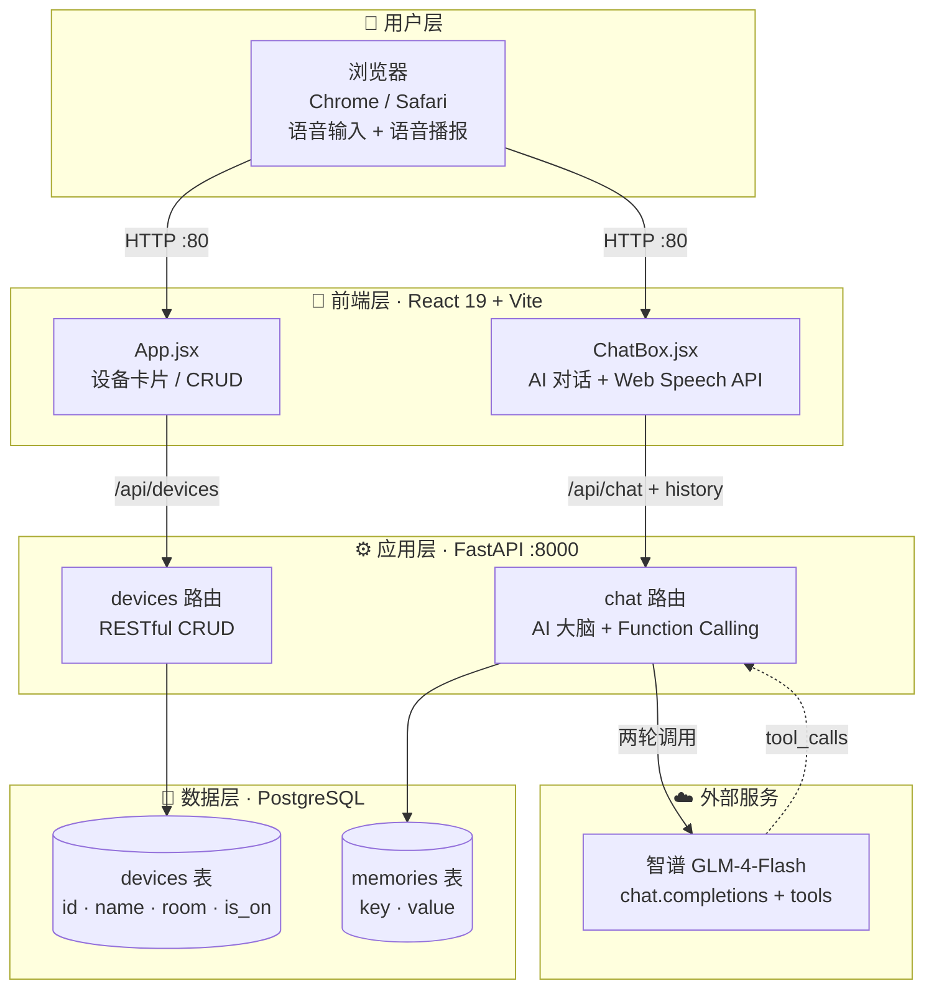

# 🪴 AI 智能家居控制系统

> 用一句自然语言控制全屋设备：「关卧室空调」「我快到家了」「记住我喜欢 26 度」
>
> 后端 FastAPI + GLM-4 Function Calling，前端 React 19 + 语音输入/播报，数据 PostgreSQL，一键 Docker Compose 部署。



---

## 目录

- [功能特性](#功能特性)
- [技术栈](#技术栈)
- [系统架构](#系统架构)
- [目录结构](#目录结构)
- [快速开始：Docker 一键启动](#快速开始docker-一键启动)
- [本地裸机开发](#本地裸机开发)
- [API 文档](#api-文档)
- [AI 工具集（Function Calling）](#ai-工具集function-calling)
- [测试](#测试)
- [常见问题](#常见问题)
- [安全提示](#安全提示)

---

## 功能特性

- **设备管理**：增删改查 + 一键开关，状态幂等（重复开关返回 400 而非崩溃）。
- **AI 自然语言控家**：基于智谱 GLM-4-Flash + Function Calling，用户说人话，AI 自动决策调用哪个工具。
- **多轮对话**：前端携带最近 10 条历史，AI 不会"金鱼脑"。
- **长期记忆**：用户名、偏好温度、生活习惯等通过 `memories` 表持久化，每次对话注入 System Prompt。
- **场景模式**：
  - 🌙 **晚安模式**：`turn_off_all_devices` 一键全关
  - 🏠 **回家模式**：`welcome_home_mode` 根据模拟室外温度自动开空调到舒适温度 + 点亮客厅灯
- **语音交互**：浏览器原生 Web Speech API，无需任何 SDK，支持中文语音输入与播报。

---

## 技术栈

| 层 | 技术 | 版本 |
|---|---|---|
| 前端 | React + Vite | React 19 · Vite 8 |
| 后端 | FastAPI + Uvicorn | FastAPI 0.115 |
| ORM | SQLAlchemy | 2.0 |
| 数据库 | PostgreSQL | 15-alpine |
| 大模型 | 智谱 GLM-4-Flash | Function Calling |
| 容器化 | Docker + Docker Compose | 多阶段构建 |

---

## 系统架构



**数据流说明**：

1. 用户在前端通过文字或语音输入指令（如「关卧室空调」）。
2. 前端把当前消息 + 最近 10 条历史一并发到 `/api/chat`。
3. 后端动态构造 System Prompt（包含设备清单 + 长期记忆），调用 GLM-4-Flash。
4. GLM 返回 `tool_calls`，后端执行对应工具（开关设备 / 写记忆等）。
5. 把工具执行结果回灌给 GLM，让它生成自然语言回复。
6. 前端展示回复 + 语音播报，并刷新设备列表。

---

## 目录结构

```
ai-smart-home/
├── docker-compose.yml          # 一键启动：db + backend + frontend
├── backend.Dockerfile          # 后端镜像（多阶段构建）
├── frontend.Dockerfile         # 前端镜像（构建 + Nginx 反代）
├── docker/
│   └── nginx.conf              # 前端 Nginx 配置（SPA fallback + /api 反代）
├── .env.example                # 环境变量模板
├── .dockerignore
├── .gitignore
│
├── backed/                     # 后端代码（保留原仓库拼写）
│   ├── main.py                 # FastAPI 入口
│   ├── database.py             # ORM 模型 + 引擎配置
│   ├── home_device.py          # Device 领域模型 + 自定义异常
│   ├── requirements.txt        # Python 依赖
│   ├── .env.example
│   ├── app/
│   │   ├── crud.py             # 数据库 CRUD 操作
│   │   ├── schemas.py          # Pydantic 请求/响应模型
│   │   └── routers/
│   │       ├── devices.py      # /api/devices RESTful CRUD
│   │       └── chat.py         # /api/chat AI 对话 + Function Calling
│   └── test_home_devices.py    # pytest 单元测试
│
├── frontend/                   # 前端代码
│   ├── package.json
│   ├── vite.config.js
│   ├── index.html
│   ├── .env.example
│   └── src/
│       ├── main.jsx
│       ├── App.jsx             # 设备管理面板
│       ├── ChatBox.jsx         # AI 聊天 + 语音
│       ├── App.css             # 温馨家居风配色
│       └── index.css
│
└── download/
    └── architecture.png        # 系统架构图（PNG）
```

---

## 快速开始：Docker 一键启动

> 适合第一次跑、演示、生产部署。前置条件：本机已装 Docker 和 Docker Compose。

### 1. 准备环境变量

```bash
cd ai-smart-home
cp .env.example .env
# 编辑 .env，填入你的 GLM_API_KEY
# 获取地址：https://open.bigmodel.cn/
```

`.env` 关键字段：

```dotenv
GLM_API_KEY=xxxxxxxxxxxx.xxxxxxxxxxxx
POSTGRES_USER=admin
POSTGRES_PASSWORD=123456
POSTGRES_DB=smart_home
DATABASE_URL=postgresql://admin:123456@db:5432/smart_home
VITE_API_BASE=
```

### 2. 启动

```bash
docker compose up -d --build
```

首次构建约 2-3 分钟（拉镜像 + npm install + pip install）。

### 3. 访问

| 服务 | 地址 |
|---|---|
| 🏠 前端 | http://localhost |
| ⚙️ 后端 API | http://localhost:8000 |
| 📖 OpenAPI 文档 | http://localhost:8000/docs |
| 💾 PostgreSQL | localhost:5432 |

### 4. 查看日志

```bash
docker compose logs -f backend   # 后端日志
docker compose logs -f frontend  # Nginx 日志
docker compose logs -f db        # 数据库日志
```

### 5. 停止 / 清理

```bash
docker compose down              # 停止并删除容器（保留数据卷）
docker compose down -v           # 同时删除数据卷（⚠️ 数据库会被清空）
```

---

## 本地裸机开发

适合二次开发调试，热重载更快。

### 数据库

```bash
docker run -d --name smart-home-pg \
  -e POSTGRES_USER=admin \
  -e POSTGRES_PASSWORD=123456 \
  -e POSTGRES_DB=smart_home \
  -p 5432:5432 \
  postgres:15-alpine
```

### 后端

```bash
cd backed
python -m venv venv && source venv/bin/activate
pip install -r requirements.txt
cp .env.example .env  # 填入 GLM_API_KEY
uvicorn main:app --reload --port 8000
```

### 前端

```bash
cd frontend
cp .env.example .env.local  # 默认指向 localhost:8000
npm install
npm run dev    # http://localhost:5173
```

---

## API 文档

### 设备管理

| 方法 | 路径 | 说明 |
|---|---|---|
| GET | `/api/devices` | 列出所有设备 |
| POST | `/api/devices` | 新建设备（body: `{name, room}`） |
| POST | `/api/devices/{id}/on` | 打开设备（已开则 400） |
| POST | `/api/devices/{id}/off` | 关闭设备（已关则 400） |
| DELETE | `/api/devices/{id}` | 删除设备 |

### AI 对话

```http
POST /api/chat
Content-Type: application/json

{
  "message": "关卧室空调",
  "history": [
    {"role": "user", "content": "今天好热"},
    {"role": "assistant", "content": "要不要帮您打开空调？"}
  ]
}
```

响应：

```json
{
  "reply": "好的，已为您关闭卧室的空调。"
}
```

完整的交互式 API 文档见 http://localhost:8000/docs（Swagger UI）。

---

## AI 工具集（Function Calling）

`backed/app/routers/chat.py` 中定义了 6 个工具，GLM 会根据用户意图自动选择调用：

| 工具 | 触发场景 | 示例用户输入 |
|---|---|---|
| `control_device` | 开关单个设备 | "关卧室空调"、"把客厅灯打开" |
| `add_device` | 录入新设备 | "我买了个微波炉，放在厨房" |
| `delete_device` | 删除设备 | "把那个坏掉的台灯删了" |
| `turn_off_all_devices` | 全屋关闭 | "我要出门了"、"晚安" |
| `welcome_home_mode` | 回家模式 | "我快到家了"、"我回来了" |
| `save_user_memory` | 保存用户偏好 | "记住我喜欢 26 度"、"我叫张三" |

**回家模式逻辑**：根据模拟室外温度（28-38℃ 随机）自动决策空调模式：
- \> 30℃：制冷 24℃
- < 15℃：制热 26℃
- 其他：舒适送风 25℃

---

## 测试

后端领域模型的单元测试（基于 pytest）：

```bash
cd backed
pytest test_home_devices.py -v
```

覆盖场景：
- 设备初始状态为关闭
- 正常开启 / 关闭流程
- 重复开启抛出 `DeviceAlreadyOnError`
- 重复关闭抛出 `DeviceAlreadyOffError`

---

## 常见问题

### Q1：前端能打开，但聊天框一直显示"❌ 连接失败"
- 检查 `GLM_API_KEY` 是否正确配置：`docker compose exec backend env | grep GLM`
- 查看后端日志：`docker compose logs backend`
- 国内网络访问智谱 API 偶尔超时，可重试一次。

### Q2：语音输入没反应
- Web Speech API 仅 Chrome / Edge / Safari 支持，Firefox 不支持。
- 需要在 HTTPS 或 localhost 下访问，否则浏览器拒绝授权麦克风。
- Docker 部署后通过 IP 访问时浏览器会拒绝麦克风，建议用 localhost 或加 HTTPS 反代。

### Q3：改了前端代码，怎么重新构建？
```bash
docker compose up -d --build frontend
```

### Q4：怎么重置数据库？
```bash
docker compose down -v   # ⚠️ 会清空所有数据
docker compose up -d --build
```

### Q5：端口被占用怎么办？
修改 `docker-compose.yml` 中的端口映射，例如把 `"80:80"` 改成 `"8080:80"`。

---

## 安全提示

- ⚠️ **`.env` 文件含真实密钥，已被 `.gitignore` 忽略，切勿提交到 git。**
- 生产环境请把 `docker-compose.yml` 中前端的 `allow_origins=["*"]` 改为具体域名。
- PostgreSQL 默认密码 `123456` 仅供本地开发，生产请改强密码。
- 历史版本曾把真实 GLM_API_KEY 提交到 git，**如果你 fork 过这个仓库，请立即到智谱平台吊销并重置该 Key**。

---

## License

MIT
